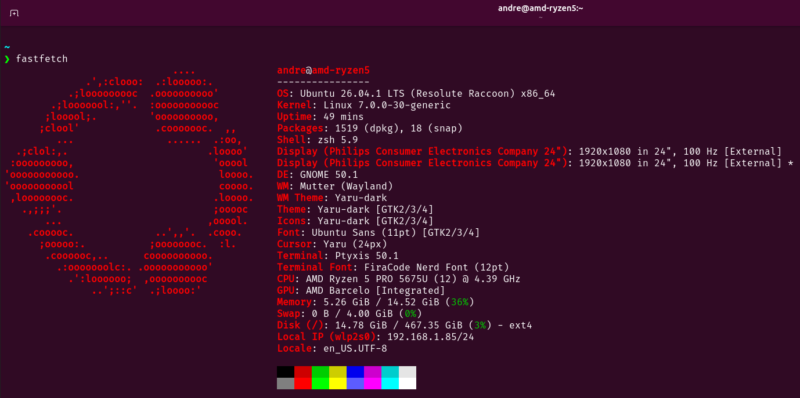
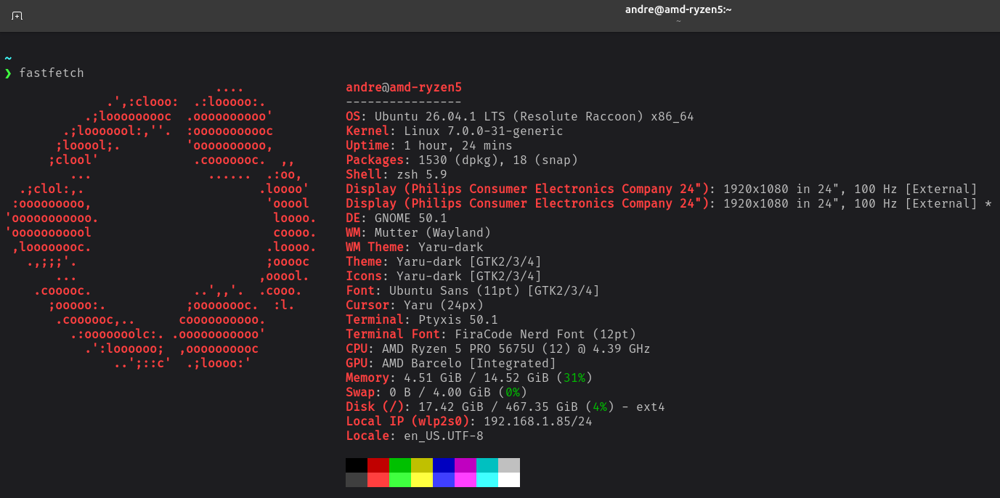

# Terminal Palettes

A collection of custom color palettes for Linux terminals.

Currently developed and tested on Ubuntu 26.04 with Ptyxis.

## 🎨 Palettes

| Palette          | Preview |
| ---------------- | ------- |
| **Ubuntu XTerm** | [](./images/ubuntu-xterm.png) |
| **VS Code**      | [](./images/vscode.png) |

## Installation

Clone the repository and enter the project directory:

```bash
git clone https://github.com/euflauzinoandre/terminal-palettes.git
cd terminal-palettes
```
> Make the installation script executable:
```bash
chmod +x install.sh
```
> Run the installation script:
```bash
./install.sh
```

## Compatibility

The palettes in this repository are primarily created and tested with Ptyxis on Ubuntu 26.04.

Compatibility with other terminal emulators may vary depending on their palette format and configuration options.

## Contributing

Feel free to suggest improvements, report issues, or contribute new palettes.

When adding a new palette, please include:

- The palette file
- A preview image
- The palette name
- Installation instructions
- Any relevant compatibility information
- License

## License

Unless otherwise specified, the contents of this repository are available under the <ins>_MIT License_</ins>.
